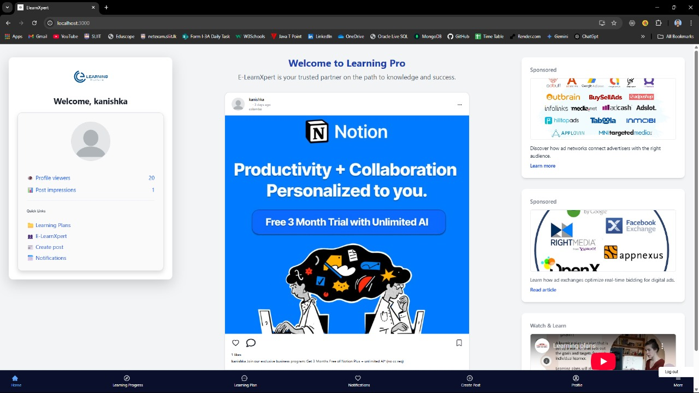

# E-LearnExpert  ( E_Learning & Shareing Social Platform )

</a>

This repository contains the source code for a  E_Learning & Shareing Social Platform web application developed using the  Spring Boot + JPA (Java Persistence API) for efficient and scalable server-side logic.

 
## Project Structure

The project structure is organized as follows:
- <b>Frontend:</b> React application.
- <b>Backend:</b>  Spring Boot + JPA (Java Persistence API) for efficient and scalable server-side logic 
- <b>𝗔𝗿𝗰𝗵𝗶𝘁𝗲𝗰𝘁𝘂𝗿𝗲: </b> Layered Architecture to ensure maintainability, scalability, and clean code structure 
- <b>𝗗𝗮𝘁𝗮𝗯𝗮𝘀𝗲: </b>  MySQL + Hibernate (ORM) for optimal data management  

